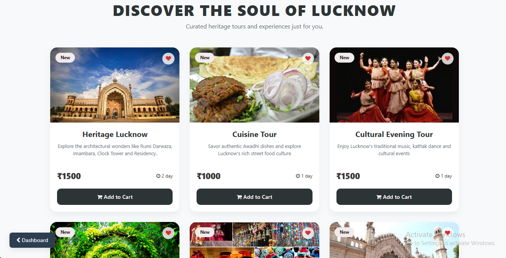
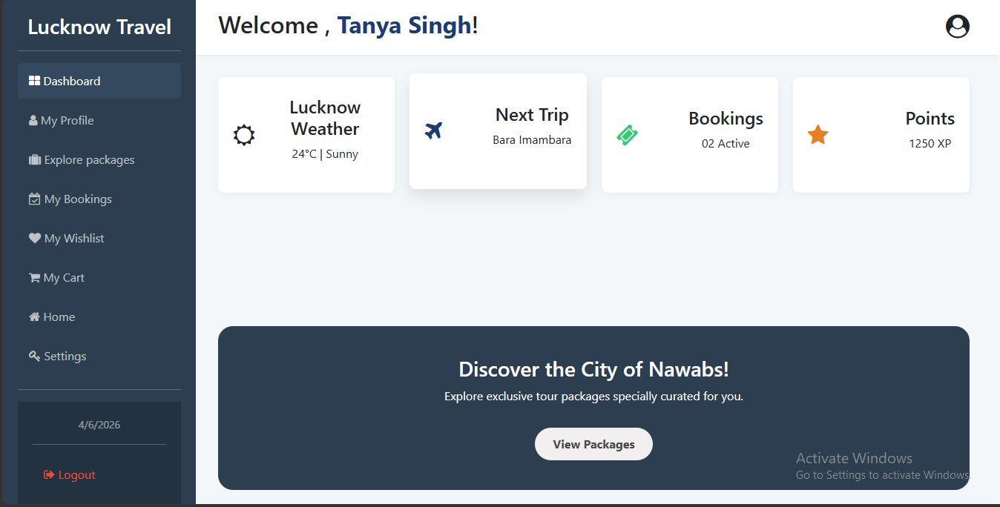
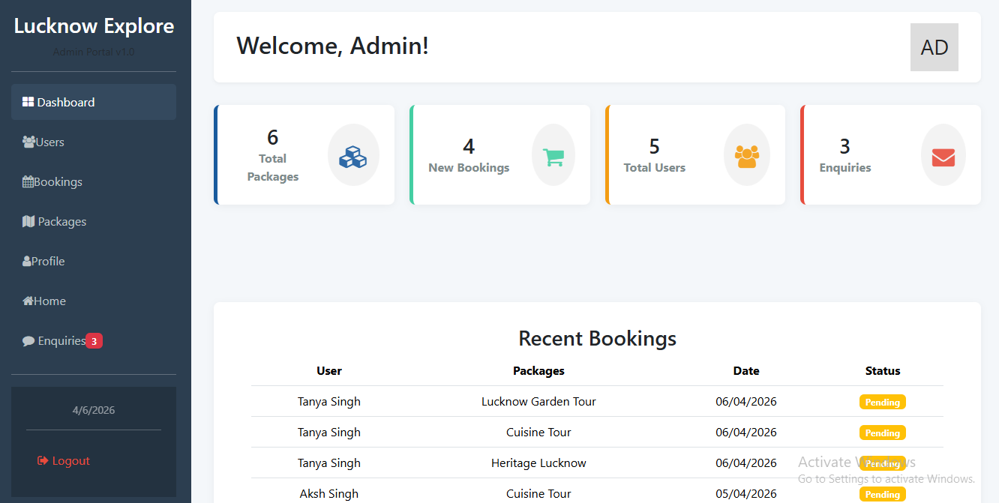
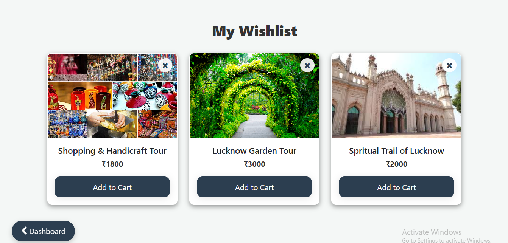
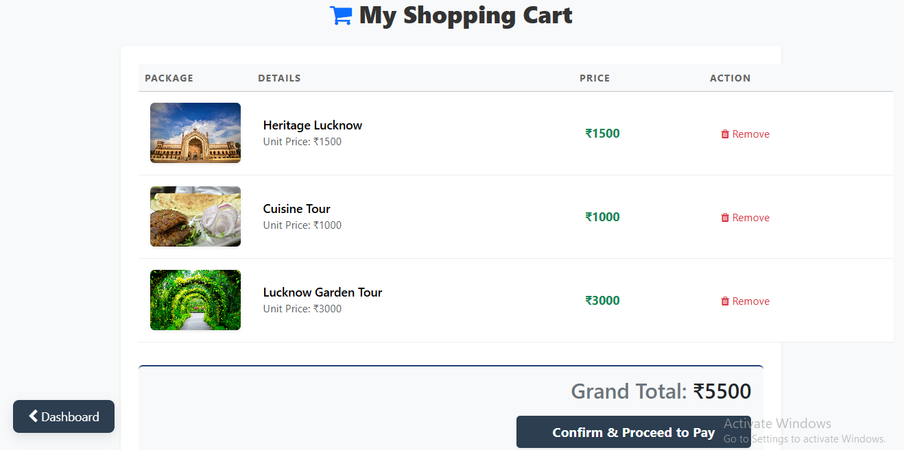
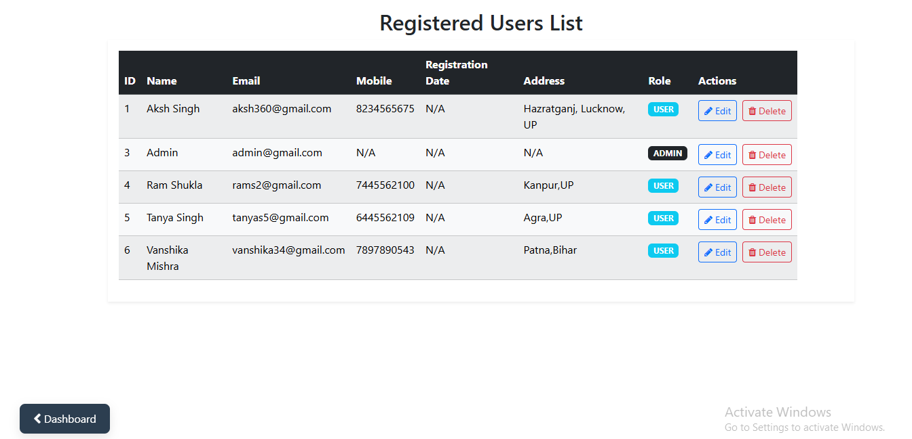
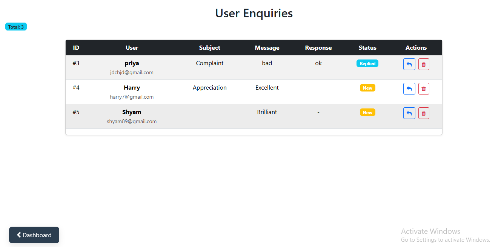
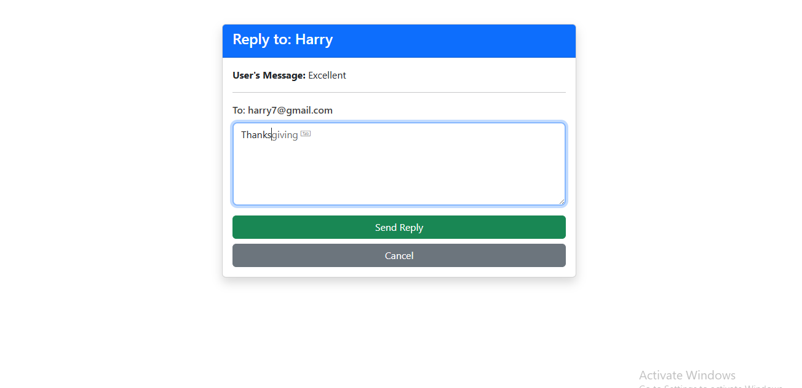

# City Tourism Booking & Guide - Full Stack Tourism Portal🌍

**City Tourism Booking & Guide** is a modern Full-Stack Web Application designed to showcase the "City of Nawabs"—Lucknow. This project provides a 
seamless interface for users to explore heritage sites, cuisine, and tour packages while offering a robust management system for 
administrators.

# 🛠️ Tech Stack & Tools
 
## Frontend
- Library : React.js (Hooks, Router, Axios)
- Styling : Bootstrap 5, Custom CSS3 Animations
- Icons : FontAwesome

## Backend
- Framework : Spring Boot 3.x
- Architecture : RESTful APIs using Spring MVC 
- ORM : Hibernate / Spring Data JPA

## Database
- System : MySQL 8.0
- Storage : Relational mapping for Users, Packages, and Bookings

## Development Tools
- VS Code (Frontend), IntelliJ IDEA (Backend), MySQL Workbench (Database)
- Git & GitHub (Version Control)

---
## ✨ Key Features

* User Dashboard : Interactive UI for browsing tour packages and managing a personal wishlist.
* Admin Panel : A dedicated dashboard for administrators to Add, Edit, or Delete tour packages and manage user data.
* Dynamic Gallery : A responsive photo gallery highlighting Lucknow's iconic monuments.
* Database Integration: Secure data handling using Hibernate for seamless object-relational mapping.
* Responsive Design : Fully optimized for Mobile, Tablet, and Desktop views.

---

## 📂 Project Directory Structure
```
Lucknow_Tourism_FullStack/
├── frontend/          # React.js Source Code
├── backend/           # Spring Boot Java Source Code
└── database/          # MySQL Database Export (.sql file)
 ```

----


## 🚀 How to Run Locally

Follow these steps to set up the project on your local machine:

1. Database Setup
* Open **MySQL Workbench**.
* Create a new schema (e.g., `lucknow_tourism_db`).
* Import the `city_tourism_db.sql` file from the `/database` folder of this repository.

2. Backend Execution (Spring Boot)
* Open the `backend` folder in **IntelliJ IDEA**.
* Navigate to `src/main/resources/application.properties`.
* Update the following credentials with your MySQL username and password:
  ```properties
  spring.datasource.url=jdbc:mysql://localhost:3306/lucknow_tourism_db
  spring.datasource.username=your_username
  spring.datasource.password=your_password   ```
* Run the application. The backend will start at ` http://localhost:8080 `

3. Frontend Execution (React)
* Open the frontend folder in **VS Code**.
* Open the terminal and run:
  npm install
* After installation, start the development server:
  npm start
* The application will be accessible at` http://localhost:3000`

## 🔗 Live Demo
- **Frontend (Netlify):** [https://city-tourism-booking-guide.netlify.app/]
- **Backend API (Render):** [https://city-tourism-booking-guide.onrender.com]
  
---

## 📸 Screenshots

 🏠 Packages Page


 👤 User Dashboard


 🛠️ Admin Dashboard


 ❤️ Wishlist


 🛒 Cart


 👥 Manage Users


 📩 Manage Enquiries


 💬 Response System


